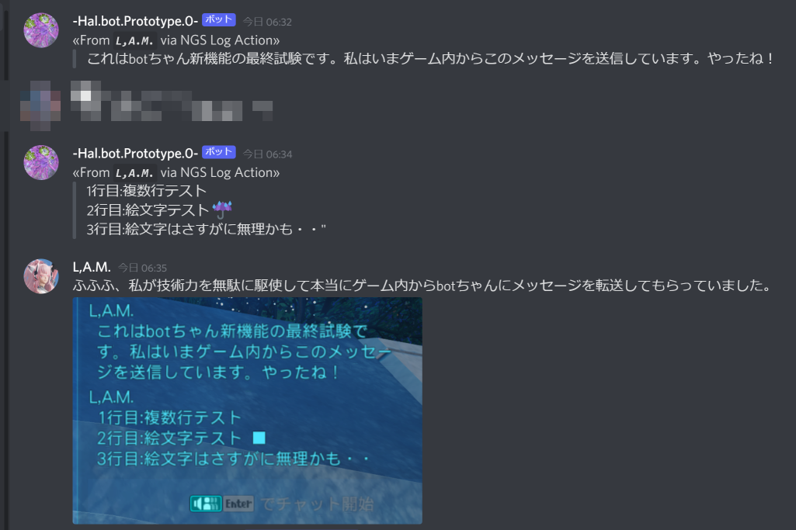

# NGS Log Action

NGS Log Action は [PSO2NGS][] のチャットに連動して「何か」をしてくれるアプリです。

- バージョンアップの新機能や調整は [Release-note.md](Release-note.md) をご確認下さい！
- ダウンロードは [Releases](https://github.com/LMA-SHIP01-PSO2NGS/ngs-log-action/releases/) からどうぞ！
- 困ったら [NGS Log Action Wiki](https://github.com/LAM-SHIP01-JP-PSO2NGS/ngs-log-action/wiki) もご覧下さい！

## 具体的にできる事の例

+ `if` 何であれ `=>` 外部ウィンドウでくっきり読める
+ `if` チャットで自分の名前を呼ばれていたら `=>` お好みの通知音を鳴らす
+ `if` `PUBLIC` 誰かがチャット（＝白チャット）で「雷雨」と発言していたら `=>` お好みの通知音を鳴らす
+ `if` `PARTY` または `GROUP` チャットで `/ラッピー/` と発言していたら `=>` お好みのコマンドを実行して何かをする
+ `if` `GUILD` 自分がチャットで「〘緊急警報発令〙ネクス・ヴェラ」と発言したら `=>` Web API `https://example.com/our_guild_sns/api` を叩く
  + 応用するとPSO2NGSでチャットに特定のキーワードを書いたり聞いたりしたら Web API 経由で Discord や Twitter の BOT に何かしてもらう、伝言のように転送して貰うこともできます。
+ `if` 取得したアイテムを集計する (>=1.3.0)
  + `if` 自身が指定したキーワードやロビーアクションを使ったら取得したアイテムの集計結果を表示する
  + `if` 1000メセタ拾う毎に取得したアイテムの集計結果を表示し音を鳴らす
  + `if` 特定のレアアイテムを取得したら音を鳴らす

### 動作例のスクリーンショット

")
")

## 使い方

1. [Releases](https://github.com/LMA-SHIP01-PSO2NGS/ngs-log-action/releases/) から最新版のアプリの製品版の .zip をダウンロードして、
2. PCのお好きな所へ zip を展開、
3. `ngs-log-action.exe` を実行します。
4. お好みの動作に近づくよう `conf.toml` を編集して少しでも快適な NGS ライフを楽しまれてください。

設定を行う `conf.toml` の書き方は付属の `conf.toml` の中に `# コメント` として書いてあります。お好みのテキストエディターで編集、あるいは `.toml` に最適化されたアプリ等で編集してお使い下さい。

## ライセンス・免責事項についての概要

- [MIT](LICENSE)

まことに勝手ながら著者は、アプリの一般的な使い方のサポートや、それ以前の技術的なご質問に対し無償で個別には対応しません。有償でサポートを受けたいという方がいらっしゃれば Amazon ギフト券払い等で検討はするかもしれません。

機能に関するご要望やご意見を頂ける事はたいへん嬉しい事ではありますが、 MIT ライセンスで提供された OSS ですので、できれば Pull-request 等の形式でコンタクト頂けると嬉しいです。

不具合やセキュリティーリスクの修正につきましても著者のリソース等にご配慮いただき優しく、また可能なワークアラウンド等を活用しながら優しくお待ち頂ければ幸いです。

## 貢献者およびスペシャルサンクス

- いつも一緒に遊んでくれるチーム「ハルファルファ」([Web](https://seesaawiki.jp/halphalfa/)/[Twitter](https://twitter.com/halphalfa_ngs)) の仲間たち

## 著者

- [L,A.M.](https://twitter.com/LAM35105379)

[PSO2NGS]:https://pso2.jp/
